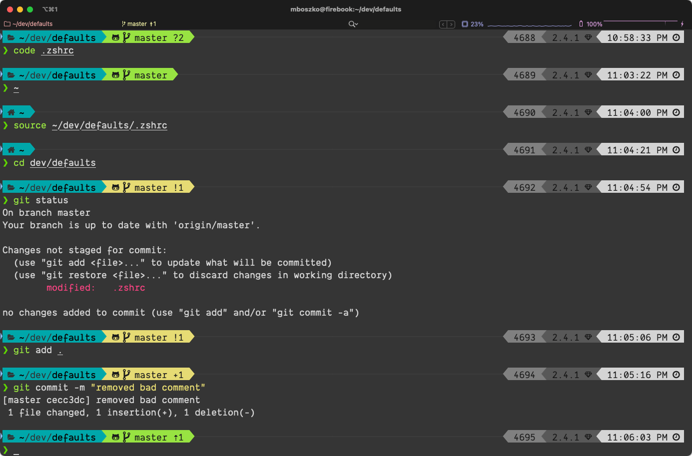

# Defaults

Stuff that I use a lot when I set up a new computer, or start a new project.

## Software

See the [Mac Essentials](https://github.com/bobtiki/defaults/blob/master/mac_essentials.md) document.

## zsh



Moving to `zsh` on all Macs from here forward, since macOS is moving to it as [the default in Catalina](https://support.apple.com/en-us/HT208050), and Omni prefers it anyway. I learned a lot from [this Scripting OS X article on moving to zsh](https://scriptingosx.com/2019/06/moving-to-zsh/).

- `zshrc` goes in `/etc/`, and is executed for all users
- `.zshrc` goes in `~/`, and is for the current user only.

[These articles on Scripting OS X](https://scriptingosx.com/2019/06/moving-to-zsh/), by Armin Briegel, are a good primer on `zsh` and the changes from `bash`.

I am now using [oh-my-zsh](https://ohmyz.sh/), as their git plugin is very nice, and I *love* the Powerlevel10k theme.

### Install these bits

#### iTerm2

```sh
brew cask install iterm2
```

I have my colors set to "Yoncé" (see below). I have saved my iTerms profile `mboszko` here in the `.iterm` folder. Copy this folder to `~/.iterm` and set iTerm2 > Preferences > General > [√] Load prefererences from a custom folder or URL: ~/.iterm

#### Oh-my-zsh

```sh
sh -c "$(curl -fsSL https://raw.github.com/ohmyzsh/ohmyzsh/master/tools/install.sh)"
```

#### [Powerlevel10k and patched font](https://gist.github.com/kevin-smets/8568070)

```
git clone https://github.com/romkatv/powerlevel10k.git $ZSH_CUSTOM/themes/powerlevel10k
```

- Download the [MesloLSGS NF](https://github.com/romkatv/powerlevel10k#fonts) font and install.
- Download the (not free, but if you're me, you have a license) [Dank Mono](https://philpl.gumroad.com/l/dank-mono) font and install.

#### [Enable auto-suggestions](https://github.com/zsh-users/zsh-autosuggestions/blob/master/INSTALL.md#oh-my-zsh)

```
git clone https://github.com/zsh-users/zsh-autosuggestions ${ZSH_CUSTOM:-~/.oh-my-zsh/custom}/plugins/zsh-autosuggestions
```

#### Enable word jumps and word deletion, aka natural text selection

By default, word jumps (option + → or ←) and word deletions (option + backspace) do not work. To enable these, go to **iTerm → Preferences → Profiles → Keys → Key Mappings → Presets... → Natural Text Editing → Boom! Head explodes**

#### Syntax Highlighting

```
brew install zsh-syntax-highlighting
```

### Adding to $PATH

    PATH=$PATH:~/opt/bin  # New path at end
    PATH=~/opt/bin:$PATH  # New path first

## Yoncé

I have made a fork of [Yoncé](https://github.com/swizzlevixen/yonce), “Queen Bey-inspired themes for all your favs,” [originally by Mina Markham](https://yoncetheme.com/). I love the colors, and there are presets for iTerm (already included in my profile here), Slack, Alfred, VS Code, etc.

## VS Code

I need to make a segment about settings and layout for VS Code, but for now it's my primary editor. 

## Python

### Venv installation and setup

- [Download the latest Python](https://www.python.org/downloads/mac-osx/) (3.10.2, as of this writing) and install
- run `Update Shell Profile.command` and `Install Certificates.command`
- Use [`virtualenv`](https://pypi.org/project/virtualenv/) and [`virtualenvwrapper`](https://pypi.org/project/virtualenvwrapper/) for **every project**
- `sudo -H pip3 install --upgrade virtualenv`
- `sudo -H pip3 install --upgrade virtualenvwrapper`
- Make sure that the `.bashrc` is updated with my [default Python settings](https://github.com/bobtiki/defaults/blob/master/.bashrc)
- `cd ~/dev` and `mkproject PROJECT_NAME_HERE` to start a new venv and project

### Other Python stuff

- `pip3 install blessings` for Python [`blessings`](https://github.com/erikrose/blessings) for printing colors and other formatting to the terminal.
- `pip3 install bpython` to install [`bpython`](https://bpython-interpreter.org/), a Python REPL wrapper that adds definition pop-ups and syntax coloring
